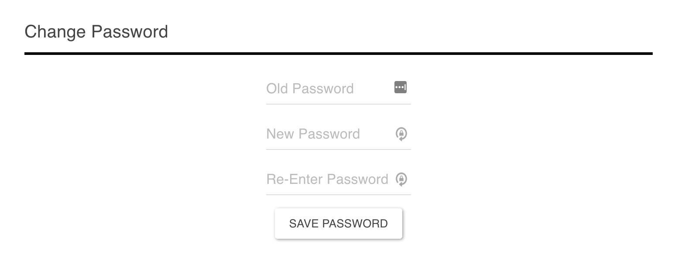

## Finance

### Procedure

This project started from the Harvard Course PSET7 with starter code involving a login and logout system. The following sections are functions that I implemented with rigorous testing. After reading up on Flask documentation, the logic behind setting up a flask application was actually quite simple. 

There was a ton of challenges in getting started with this project. It involved using multiple languages (Python, HTML, CSS, SQL) and new software (Flask, Jinja). 

Most of the functions have forms with error checking that is done in Python. This form validation could have been done by a javascript library but I wanted to develop the logic myself.

The SQL database used two tables to store the functionality of the application. One table held the users registered into the system and the other table held the transaction history of each user. 

Jinja is a templating language that I used with Python and Flask to display data that was passed from Python to HTML files. Each redirect to the index page from any other page used message flashing which displays a status. 


#### Register

The register function first confirms if the username and passwords are valid form fields as well as confirming a unique username. Once they're valid entries, the database inserts a new user with a unique id which becomes Flask's session id as well as a hashed password.


#### Quote

The quote function looks up a stock through a helper function which returns the stock name, symbol and price and then prints the price of the day. The function also returns a three year plot of the stock through the history.py file. This function and file took the longest for me to implement since I had to learn to use the basics of multiple modules to get data from google finance, plot it with matplotlib and then return it as a png image embedding it in the html. 


#### Account Settings

The account settings page has 4 form fields which gives users ability to change username, change password, add cash and the ability to delete your account. The core logic checks which of the form fields was submitted and executes logic based off of that. 

To change password, the function verifies that the old password matches the password in the database, confirms if the new password and old password are different, and then updates the database with a new hashed password. 



To change the username, the function confirms if the new username already exists, otherwise it updates the database with the new username. 


The cash adding function simply updates the user with the amount of cash that was input in the form field. Currently, the cash function takes in negative values as well which is simply for me to test the function. 


The final function is completely delete the user from the system. This removes all transactions from the transaction table, delete the user from the users table, and then remove the user id from the Flask session. 


#### Buy

The buy function allowed you to input a stock and the number of shares to purchase. A lot of error checking such as a valid stockname, non negative shares input, if the user has enough cash to purchase the number of shares was done. An SQL statement would be executed to update the users cash as well as entering the transaction history. 


#### Sell

The sell function allowed you to input a stock and the number of shares to sell. Common error checking was to check if a stock existed and aspects of the shares form field similar to the Buying function. 

The complicated process was to check if a user owned enough shares of that stock. This involved iterating through the transactions table from the SQlite database and performing an algebraic sum of the shares.

If there is no error, then the cash field in the users table is updated and the transaction is entered into the transactions table with the shares column being negative shares. 

#### History

The history function simply returns all the transactions for the user and displays it as a table. The history displays positive shares number as purchases and negative share numbers as selling for readability. 


#### Index

The index page displays all the assets that the user is invested in including the current amount of cash as well as the current total value of all the assets. As long as the user still owned shares of the stock (purchasing shares then selling shares), it would be displayed on the table. The function returns all the rows (stock assets and cash) which gets displayed by the html. 


### Setup

The flask environment needs to know which file to run when you use the command ```flask run```. You need to export the FLASK_APP environment variable ```export FLASK_APP=application.py``. 

### Dependencies

The modules required to run this application is in requirements.txt. To install the modules, simply use ``` pip install -r requirements.txt```. 